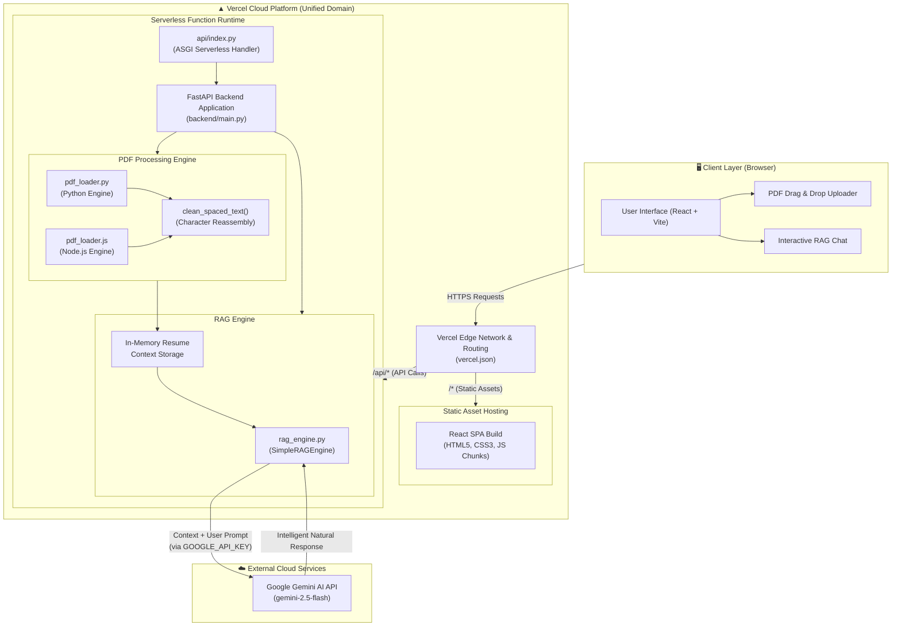
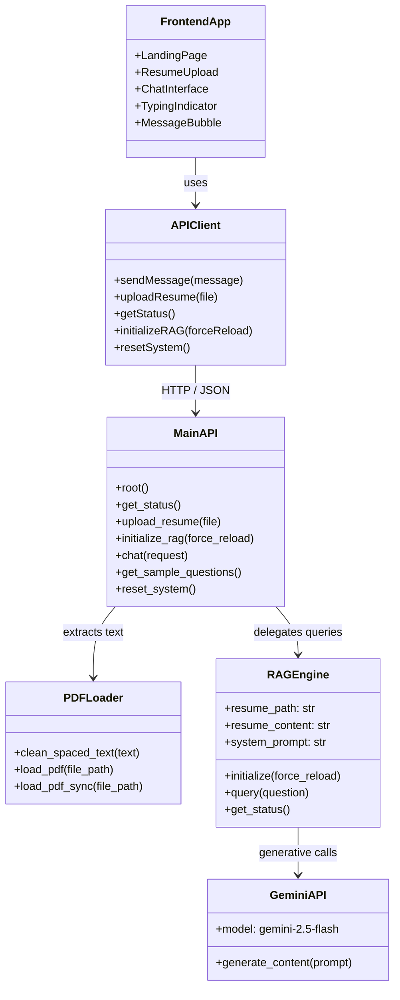
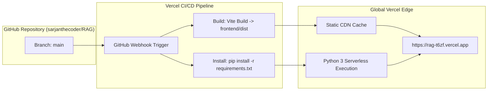

# 🏗️ System Architecture Diagram

This document illustrates the complete end-to-end architecture, data flow, and deployment model of the **RAG Resume Chatbot**.

---

## 1. High-Level System Architecture

---

## 2. Sequence Diagram: Resume Upload & Query Flow

```mermaid
sequenceDiagram
    autonumber
    actor User as 👤 User
    participant Frontend as 💻 React Frontend
    participant Gateway as ▲ Vercel Router
    participant API as ⚡ FastAPI Serverless
    participant Loader as 📄 PDF Loader
    participant Engine as 🧠 RAG Engine
    participant Gemini as 🤖 Google Gemini AI

    %% Step 1: Upload
    rect rgb(30, 41, 59)
    note right of User: Step 1: Resume Upload Flow
    User->>Frontend: Drag & drop PDF resume
    Frontend->>Gateway: POST /api/upload (multipart/form-data)
    Gateway->>API: Route to api/index.py -> upload_resume()
    API->>Loader: load_pdf(file_path)
    Loader->>Loader: Extract text pages
    Loader->>Loader: clean_spaced_text()
    Loader-->>API: Cleaned structured resume text
    API->>Engine: Initialize RAGEngine(resume_content)
    Engine-->>API: Initialized (characters count)
    API-->>Gateway: HTTP 200 { status: "success", content_length: N }
    Gateway-->>Frontend: HTTP 200 OK
    Frontend-->>User: Show Chat Interface with Sample Questions
    end

    %% Step 2: Query
    rect rgb(15, 23, 42)
    note right of User: Step 2: Intelligent Q&A Flow
    User->>Frontend: Enter question ("What are your technical skills?")
    Frontend->>Gateway: POST /api/chat { message: "..." }
    Gateway->>API: Route to api/index.py -> chat()
    API->>Engine: query(question)
    Engine->>Engine: Build Augmented Prompt (System Prompt + Resume Context + User Question)
    Engine->>Gemini: generate_content(prompt)
    Gemini-->>Engine: Generated AI response in 1st person
    Engine-->>API: Formatted answer dict
    API-->>Gateway: HTTP 200 { answer: "...", context: [...] }
    Gateway-->>Frontend: HTTP 200 OK
    Frontend-->>User: Display AI message bubble
    end
```

---

## 3. Component & Module Architecture

---

## 4. Deployment Infrastructure

